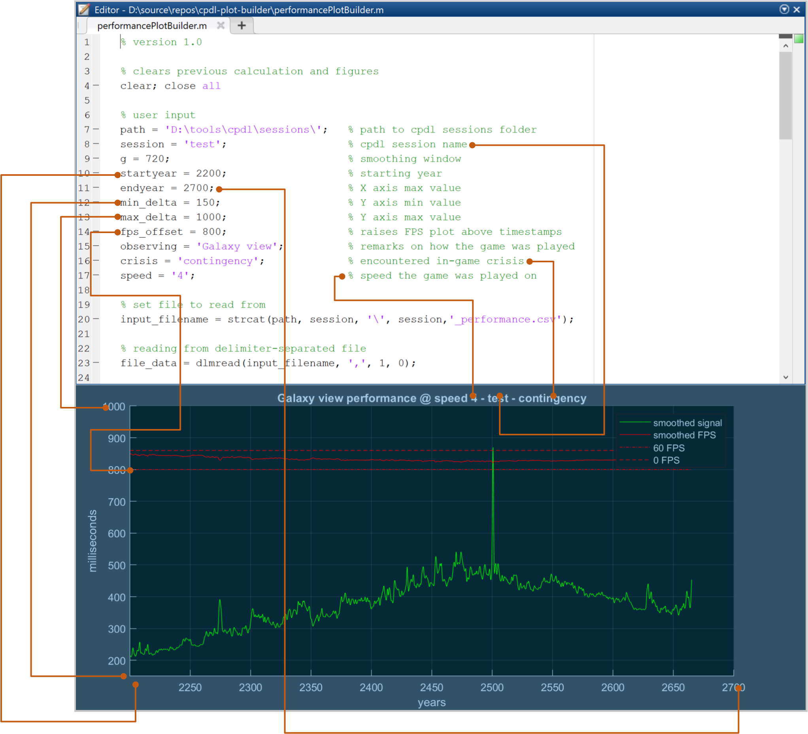

# cpdl-plot-builder
Visualization script for data obtained with [cpdl](https://github.com/serpentskirt/clausewitz-performance-data-logger).

# User input

Change values next to `user input` comment to change output plot. Use image as a reference.

# GNU Octave compatibility
Currently the script is not compatible with Octave due to `smoothdata` function being not implemented.

Plots generated by Octave look different from MATLAB ones, one might want to remove all color customization to get acceptable result.